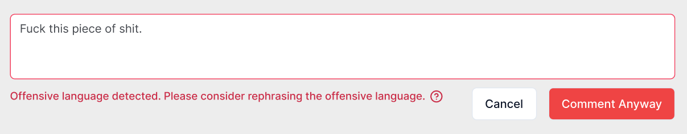
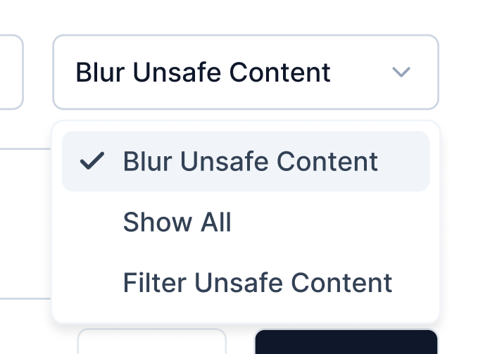
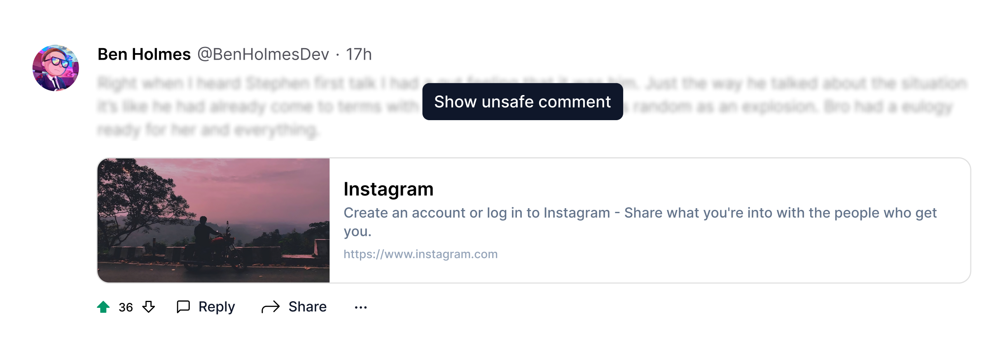

# OpenReply

OpenReply is a service that enables users to comment on any website across the internet. We deliver this functionality through a browser extension that embeds a comment section on every website, and a web application that allows users to access the comment section for any given URL. Think of it like Reddit but for the entire internet.

This repository contains all the code relevant to the browser extension and its associated backend services.

## Important Links
- 🎨 **[Figma](https://www.figma.com/design/zMCbIBF0KdTQKrToh91qKB/OpenReply-Extension-UI)**
- ✍️ **[Notion Tasks](https://atom-forest-4af.notion.site/617c696b0bff42ab9af6954c029d5da2?v=a3786af5cfe9430388ada741fe5762a2&pvs=25)**

## Table of Contents
- [Tech Stack](#tech-stack)
- [Structure](#structure)
  - [Content Script](#content-script)
  - [Background Script](#background-script)
- [Contributing](#contributing)
  - [shadcn/ui Import Issues](#shadcnui-import-issues)
  - [Coding Standards](#coding-standards)
  - [Color Palette](#color-palette)
- [Concepts](#concepts)
  - [Comments](#comments)
    - [Philosophy](#philosophy)
    - [Offensive Speech Detection](#offensive-speech-detection)
    - [Comment Ranking Algorithm](#comment-ranking-algorithm)
      - [Controversy Score](#controversy-score)
      - [Wilson Score Interval](#wilson-score-interval)
    - [Comment Recommendation Algorithm](#comment-recommendation-algorithm)
      - [Hot Score](#hot-score)
    - [Replying](#replying)
    - [Flagging Comments](#flagging-comments)
  - [Websites](#websites)
    - [Philosophy](#philosophy-1)
    - [Safety](#safety)
  - [Feed](#feed)

## Tech Stack
- **Framework**: [WXT](https://wxt.dev) and [React](https://react.dev/)
- **Styling**: [Tailwind CSS](https://tailwindcss.com/)
- **UI Components**: [shadcn/ui](https://ui.shadcn.com/)
- **Database**: [Firebase Realtime Database](https://firebase.google.com/docs/database) and [Firestore](https://firebase.google.com/docs/firestore)
- **Authentication**: [Firebase Authentication](https://firebase.google.com/docs/auth)*
- **API**: [Firebase Functions](https://firebase.google.com/docs/functions)
- **Metrics**: *N/A*

\* Note: `auth.signInWithPopup` is non-functional with the introduction of [MV3](https://medium.com/@official.boomconsole/manifest-v2-vs-manifest-v3-in-browser-extensions-1779c6902da6). Instead, we're using `browser.identity.launchWebAuthFlow` with `GoogleAuthProvider.credential` (Credit: [Jed's comment](https://groups.google.com/a/chromium.org/g/chromium-extensions/c/xQmZLc8cu6Q/m/13noLGbhAQAJ)). For more information on this issue, please [read here](https://groups.google.com/a/chromium.org/g/chromium-extensions/c/xQmZLc8cu6Q).

## Structure
The extension is built with the [WXT Framework](https://wxt.dev). There are two main entrypoints:
- 🖼️ **[Content Script](#content-script)**
- 🧠 **[Background Script](#background-script)**

### Content Script
The content script runs inside the webpage. OpenReply utilizes the [Shadow DOM](https://developer.mozilla.org/en-US/docs/Web/API/Web_components/Using_shadow_DOM) to render a [Custom Element](https://developer.mozilla.org/en-US/docs/Web/API/Web_components/Using_custom_elements) containing the React WebApp. This approach differs from directly injecting React code into the webpage or rendering the React WebApp inside an HTML iframe. Each method has its pros and cons, which you can study [here](https://wxt.dev/guide/key-concepts/content-script-ui.html).

One notable drawback of using WXT's Shadow Root approach for the Content Script UI is the lack of Hot Module Replacement (HMR), which can make development somewhat cumbersome.

The UI is built with **TailwindCSS** and **shadcn/ui** components. All UI designs are available in [this Figma file](https://www.figma.com/design/zMCbIBF0KdTQKrToh91qKB/OpenReply-Extension-UI). Documentation for the pages can be found [here](/entrypoints/content/pages/README.md).

### Background Script
The background script (for MV2) or service worker (MV3) runs in the background, remaining active for the entire duration the browser is open. It's ideal for event handling, state management, and API calls. [Read more](https://developer.mozilla.org/en-US/docs/Mozilla/Add-ons/WebExtensions/Background_scripts).

For information on how WXT handles the background page, see [here](https://wxt.dev/guide/directory-structure/entrypoints/background.html).

The background script handles:
- **API Calls**: Reading from and writing to the database (either **Realtime Database** or **Firestore**, via **Firebase Functions**).
- **Authentication**: Managing authentication, maintaining the auth state, and sending events to content scripts when the auth state changes.
- **Offline Storage**: Caching data locally with **[localforage](https://github.com/localForage/localForage)**.

## Contributing
Here are some things to keep in mind when contributing to OpenReply.

### shadcn/ui Import Issues
Due to the unconventional nature of the project, installing shadcn/ui components requires two additional steps:
1. After installation, go to the relevant component file under `entrypoints/content/components/ui` and fix the import issue by removing `open-reply-extension` from the import paths. Example: `@/open-reply-extension/entrypoints/content/lib/utils` -> `@/entrypoints/content/lib/utils`.
2. Check if the added component displays an overlay. If it does, please add `useShadowRootElement` (can be found in `select.tsx` or `alert-dialog.tsx`) and configure the component accordingly. This needs to be done since the OpenReply panel renders inside a Shadow Root custom element, and Radix UI components usually attach themselves to the root of the original page.

### Coding Standards
Please refer to **[this document](https://atom-forest-4af.notion.site/Coding-Standards-100bc974f49280479c28f7865179228b?pvs=4)** to learn more about the tooling we use and the Coding Standards are OpenReply.

### Color Palette
We've defined some custom color palettes for use across the extension and the webapp. You can find the colors [here](https://www.figma.com/design/zMCbIBF0KdTQKrToh91qKB/OpenReply-Extension-UI?node-id=394-178&t=dbZ91TpsE2I48oZ1-4).

To use the colors in your components, you can refer to the **Custom Colors** section in the [style.css](entrypoints\content\style.css) file. Here's an example:
- Using the brand primary color as the text color: `text-brand-primary`
- Using the custom green color as the background color: `bg-green`
- Using the border secondary color as the border color: `border-2 border-border-secondary`

*And so on..*

## Concepts
This section introduces the logical components behind OpenReply and how they interact.

### Comments
#### Philosophy
Comments are the most crucial primitive in OpenReply, containing socially-important and nuanced information. Uncensored opinions from individuals with diverse experiences are fundamentally valuable in the pursuit of truth about a particular subject. This aligns with how humans naturally function.

However, these opinions should strive to be free of offensive speech. **All opinions are welcome**, regardless of how radical, as long as they are expressed politely and resemble real-world conversations.

#### Offensive Speech Detection
To achieve this goal, we check all comments for offensive content *before* they are posted. OpenReply notifies users if their comment contains offensive speech and suggests ways to rephrase it politely.



*After* a comment is posted, we don't downrank it for offensiveness, but readers have options to manage offensive content.



If the reader has chosen to blur unsafe comments, they will appear as follows:



#### Comment Ranking Algorithm
Comments are ranked according to two time-independent ranking algorithms:
- **[Controversy Score](#controversy-score)**
- **[Wilson Score Interval](#wilson-score-interval)**

##### Controversy Score
The Controversy Score Algorithm, originally implemented in [_sorts.pyx](https://github.com/reddit/reddit/blob/master/r2/r2/lib/db/_sorts.pyx), is useful for sorting comments based on the controversy they generate. This helps in identifying contrarian opinions. It is computed as:

```math
\text{ControversyScore} = \begin{cases} 
0 & \text{if } \text{downvotes} \leq 0 \text{ or } \text{upvotes} \leq 0 \\[2ex]
(\text{upvotes} + \text{downvotes})^{\frac{\text{downvotes}}{\text{upvotes}}} & \text{if } \text{upvotes} > \text{downvotes} \\[2ex]
(\text{upvotes} + \text{downvotes})^{\frac{\text{upvotes}}{\text{downvotes}}} & \text{if } \text{upvotes} \leq \text{downvotes}
\end{cases}
```

##### Wilson Score Interval
The Wilson Score Interval Algorithm, originally implemented in [_sorts.pyx](https://github.com/reddit/reddit/blob/master/r2/r2/lib/db/_sorts.pyx), generates a time-independent popularity score for comments.

The advantage of the confidence sort is that submission time is irrelevant (unlike the hot sort or Hacker News's ranking algorithm). Comments are ranked by confidence and data sampling — i.e., the more votes a comment receives, the more accurate its score becomes. It is computed as:

```math
\text{WilsonScoreInterval} = \frac{
  \frac{\text{upvotes}}{\text{upvotes} + \text{downvotes}} + 
  \frac{1}{2(\text{upvotes} + \text{downvotes})} z^2 - 
  z \sqrt{\frac{\frac{\text{upvotes}}{\text{upvotes} + \text{downvotes}}
  (1 - \frac{\text{upvotes}}{\text{upvotes} + \text{downvotes}})}
  {\text{upvotes} + \text{downvotes}} + 
  \frac{z^2}{4(\text{upvotes} + \text{downvotes})^2}}
}{
  1 + \frac{1}{\text{upvotes} + \text{downvotes}} z^2
}
```

#### Comment Recommendation Algorithm
While commenting on any website and reading others' comments is valuable, discovering similar comments and websites aligned with users' interests enhances the experience. Content discovery adds value by surfacing interesting and relevant comments from websites users might not otherwise encounter, which can then appear on their **[Feed](#feed)**.

When a comment is posted, we attempt to classify it against 100+ [topics](./constants/database/comments-and-replies.ts#L58) using the GPT 4o-mini model, identifying the top-3 most relevant topics. The comment's reference is then copied to the `topics/${topic}` in the database, along with the comment's scores (controversial, wilson, etc.).

Here, another ranking algorithm is used to generate time-dependent scores for comments, called the **[Hot Score](#hot-score)**.

##### Hot Score
The Hot Score is a time-dependent ranking algorithm useful for ranking comments in the feed. The original Hot Score algorithm is implemented in [_sorts.pyx](https://github.com/reddit/reddit/blob/master/r2/r2/lib/db/_sorts.pyx). It is computed as:

```math
\text{HotScore} = \text{round}\left(\text{sign}(s) \cdot \log_{10}(\max(|s|, 1)) + \frac{\text{seconds}}{45000}, 7\right)
```

#### Replying
Users can reply to comments, but it's a single-threaded discussion unlike Reddit's infinitely branching replies. However, replies can target other replies by tagging the user who posted the first reply, similar to Instagram's comment reply feature.

#### Flagging Comments
🚧 In progress

### Websites
#### Philosophy
With over a billion websites, each containing numerous webpages (**[YouTube alone has 14 billion public videos](https://www.theatlantic.com/technology/archive/2024/01/how-many-videos-youtube-research/677250/)**), we need an efficient way to index websites through OpenReply's service. Instead of using the website URL as the key (which can be inconsistent due to hash states or excessive length), we use the SHA512 hash of the *URL* (defined as `window.location.host + window.location.pathname + window.location.search`) as the key.

This is a well-studied problem, and the probability of collisions is [astronomically low](https://crypto.stackexchange.com/questions/89558/are-sha-256-and-sha-512-collision-resistant). For further reading: "**[Why not use BLAKE2b instead of SHA512?](https://www.reddit.com/r/BorgBackup/comments/18psos5/is_blake2_unnecessary_on_newer_cpus_ryzen)**"

#### Safety
🚧 In progress

### Feed
🚧 In progress